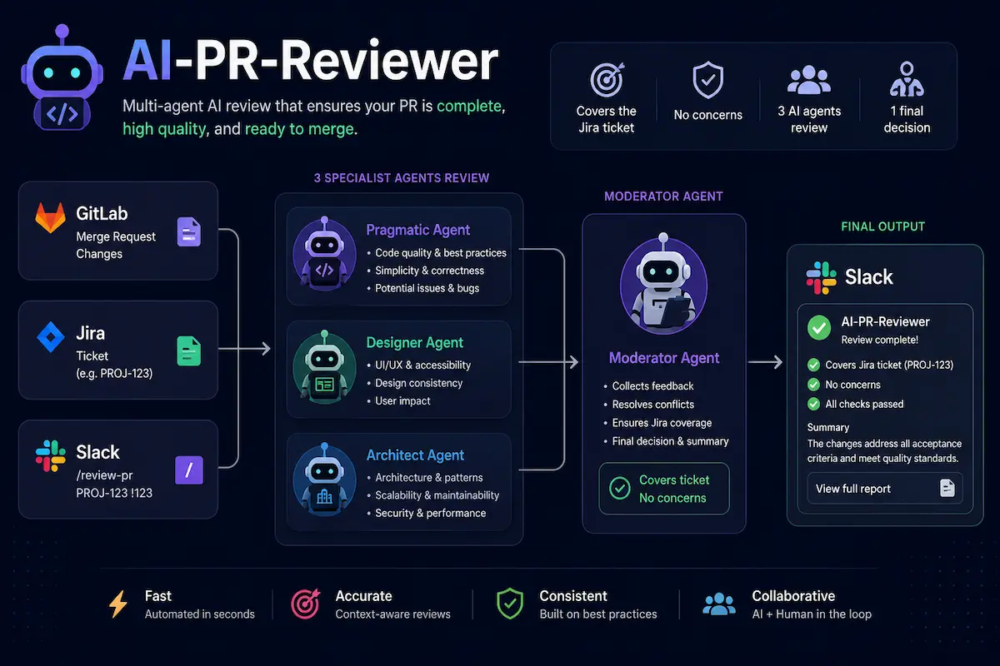

# ai-pr-reviewer

`ai-pr-reviewer` is a stateless Slack slash-command service that runs an AI-assisted merge request review. A developer runs `/review` with a GitLab merge request URL and a Jira ticket URL, and the service fetches both contexts, runs a multi-agent OpenAI review, and posts the result back to Slack.

## Why

Code reviews often need both implementation context and ticket intent. This service combines the merge request diff with the ticket description, then asks specialised AI reviewers to check behaviour, architecture, security, performance, readability, and tests.

## Features

- Slack `/review` slash command endpoint.
- Slack signature validation and replay protection.
- GitLab merge request diff fetching.
- Jira issue fetching with Atlassian Document Format text extraction.
- Multi-agent OpenAI review using local markdown skill prompts.
- Non-interactive agent contract for Slack workflows.
- Slack `response_url` result posting.
- Stateless operation with no database or queue.

## Architecture

```text
Slack /review
  -> internal/webhook validates and classifies URLs
  -> internal/review orchestrates the async review
  -> internal/gitlab fetches and formats MR diff
  -> internal/jira fetches and formats ticket context
  -> internal/agents runs OpenAI reviewer rounds
  -> internal/slack formats and posts the result
```

## Prerequisites

- Go 1.22 or newer.
- A Slack app with a slash command.
- A GitLab token that can read merge requests.
- Jira API credentials.
- An OpenAI API key.

## Configuration

All configuration is read from environment variables.

| Variable | Required | Default | Description |
|---|---:|---|---|
| `PORT` | No | `8080` | HTTP server port. |
| `SLACK_SIGNING_SECRET` | Yes | | Slack signing secret for request verification. |
| `SLACK_BOT_TOKEN` | No | | Reserved for future direct Slack Web API posting. |
| `GITLAB_TOKEN` | Yes | | Token used for GitLab API requests. |
| `GITLAB_BASE_URL` | No | `https://gitlab.com` | GitLab instance base URL. |
| `JIRA_BASE_URL` | Yes | | Jira instance base URL. |
| `JIRA_EMAIL` | Yes | | Jira account email for basic auth. |
| `JIRA_TOKEN` | Yes | | Jira API token. |
| `OPENAI_API_KEY` | Yes | | OpenAI API key. |
| `OPENAI_MODEL` | No | `gpt-4o` | OpenAI model used for every agent round. |
| `OPENAI_REASONING_EFFORT` | No | | Optional OpenAI reasoning effort. When set, must be `low`, `medium`, `high`, or `xhigh`. |
| `OPENAI_REVIEW_ROUNDS` | No | `2` | Number of configured review rounds. Must be `1` or `2`. |
| `REVIEW_TRACE_ENABLED` | No | `false` | Enables local review trace diagnostics. |
| `REVIEW_TRACE_DIR` | No | `.review-traces` | Directory where review traces are written when enabled. |
| `REVIEW_TRACE_INCLUDE_PROMPTS` | No | `false` | Includes agent prompt content in trace output when tracing is enabled. |

## Slack App Setup

Create a Slack slash command named `/review` and set the request URL to:

```text
https://your-service-host/slack/review
```

Slack sends command text in the request body. The service expects one GitLab merge request URL and one Jira ticket URL in either order.

## Local Development

Copy the example environment file and set real values:

```sh
cp .env.example .env
```

Run the service:

```sh
go run ./cmd/server
```

Health check:

```sh
curl http://localhost:8080/health
```

### Local review helper

Run a local review without Slack, ngrok, webhook.site, or any external callback URL:

```sh
go run ./cmd/local-review
```

The helper loads `.env` from the repository root, using simple `KEY=value` lines and ignoring blank lines and comments. Existing process environment variables take precedence over `.env` values. For this helper only, `PORT` defaults to `8888` when unset.

`SLACK_SIGNING_SECRET` is required because the helper submits to the local `/slack/review` endpoint with a real Slack-compatible HMAC signature. The submitted `response_url` points to a loopback-only callback server on `127.0.0.1`; nothing is sent to Slack or any other external callback service.

If `http://127.0.0.1:<PORT>/health` is already healthy, the helper reuses that server and will not stop it. When reusing an existing server, it must already have review traces enabled and must write traces that include the exact GitLab MR URL and any Jira ticket URL provided. Set:

```sh
REVIEW_TRACE_ENABLED=true
REVIEW_TRACE_DIR=.review-traces
```

If no healthy server is running, the helper starts `go run ./cmd/server`, forces `REVIEW_TRACE_ENABLED=true`, defaults `REVIEW_TRACE_DIR` to `.review-traces`, writes server logs to `.local-review-server.log`, and stops only that child server when the helper exits.

The helper prompts on stderr for the GitLab MR URL, optional Jira ticket URL, model, reasoning effort, review rounds, and optional additional review instruction. Model, reasoning, and review-round prompts show their local environment defaults, such as `OPENAI_MODEL`, `OPENAI_REASONING_EFFORT`, and `OPENAI_REVIEW_ROUNDS`, because these values are not secret. Valid reasoning effort values are `low`, `medium`, `high`, and `xhigh`; valid review-round values are `1` and `2`.

The optional additional instruction guides review scope, such as asking the reviewer to focus on a specific risk or implementation area. It cannot suppress safety-critical findings visible in the diff, including secrets, exploitable security vulnerabilities, data-loss risks, or production-breaking correctness issues.

Progress, prompts, errors, and diagnostics are written to stderr. Progress lines are prefixed with `[review]`, for example `[review] Fetching merge request context...` and `[review] Review complete.` On success, stdout contains the parsed review extracted from the newest matching trace plus the elapsed completion line, such as `Review completed in 2m13s`.

To run the helper from any directory, add a shell function to `~/.zshrc` or your shell's equivalent config:

```zsh
ai-reviewer() {
  (cd /Users/<user-name>/<path-to-this-folder>/ai-pr-reviewer && go run ./cmd/local-review "$@")
}
```

After reloading your shell config, run `ai-reviewer` from any directory. If the repo is cloned elsewhere, adjust the path in the function.

#### Example output

```markdown
## Ticket Coverage

Partially covered. The merge request updates the service contract, generated client files, application checks, dashboard layout, widget settings, and audit event handling. It does not appear to include every optional review view refinement described by the ticket.

## Blockers

None found.

## Warnings

None found.

## Suggestions

- Consider confirming whether the omitted review view refinements are intentionally deferred.
- Consider adding a focused unit test around the new widget settings behaviour if it is expected to remain stable.
- Consider documenting when consumer files should be regenerated after service contract changes.

## Assumptions

- The generated client files were produced by the repository's normal generation command.
- The existing API checks and application checks cover the service contract change.
- The ticket allows the remaining review view refinements to be handled separately.

## Summary

Safe to merge. The implementation covers the main ticket intent, no blockers or warnings were found, and the remaining items are suggestions or scope assumptions.
```

## Docker

Build the image:

```sh
docker build -t ai-pr-reviewer .
```

Run the container locally:

```sh
docker run --rm -p 8080:8080 --env-file .env ai-pr-reviewer
```

Check the service health:

```sh
curl http://localhost:8080/health
```

Deployment platforms should provide secrets as environment variables. Set `PORT` if the platform requires the service to listen on a specific port.

## Example Commands

Jira first:

```text
/review https://jira.example.com/browse/PROJ-141 https://gitlab.example.com/platform/application/-/merge_requests/108
```

GitLab first:

```text
/review https://gitlab.example.com/platform/application/-/merge_requests/108 https://jira.example.com/browse/PROJ-141
```

## Testing

Run all tests:

```sh
go test ./...
```

Tests use local fakes and `httptest`. They do not call live Slack, GitLab, Jira, or OpenAI.

## Security Notes

- Slack requests are verified with `X-Slack-Signature` and `X-Slack-Request-Timestamp`.
- Requests older than 5 minutes or more than 5 minutes in the future are rejected.
- Secrets are read from environment variables only.
- Error messages posted to Slack avoid tokens, auth headers, and full third-party response bodies.
- Review traces are local diagnostics, disabled by default, and can contain ticket, diff, prompt, and model output data.

## Current Limitations

- Only GitLab merge requests are supported.
- Only Jira tickets are supported.
- The ticket URL is required in the MVP.
- Reviews use a strict markdown moderator format rather than JSON output.
- In-flight reviews can be lost if the process exits because the service is intentionally stateless.

## Roadmap

- GitHub pull request support.
- Bitbucket pull request support.
- Optional ticket context for teams that do not use Jira.
- Stricter structured AI output.
- Direct Slack Web API posting when `response_url` is not suitable.

## Licence

This project is released under the MIT Licence. See `LICENSE`.
